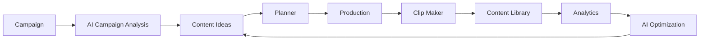

# CLIPPER — AI Content Operating System

An AI-powered operating system for clipper creators: join brand campaigns, turn their briefs into content ideas, plan, produce, clip long-form video, and learn from performance — all in one workspace.

> Designed for short-form creators on **TikTok, Instagram Reels, and YouTube Shorts**.

---

## How it works — the content loop

Clipper runs one loop. Each stage feeds the next; the analytics at the end tell the AI what to improve for the next campaign.



| Stage | App screen | What happens |
| --- | --- | --- |
| Campaign | `/campaigns` | Add a brand campaign and its requirements (deadline, reward, formats, banned topics). |
| AI Campaign Analysis | campaign detail | AI reads the brief and returns requirements, restrictions, risks, target audience, angles, strategy, and an **opportunity score**. |
| Content Ideas | `/ideas` | AI generates ideas that satisfy the brief — each with a hook, angle, structure, CTA, target platform, viral score. |
| Planner | `/planner` | Schedule the winning ideas onto a publishing calendar. |
| Production | `/production` | Kanban pipeline — idea → script → production → editing → ready. |
| Clip Maker | `/clips` | Import a long-form video URL and detect the moments worth posting. |
| Content Library | `/library` | Browse and organize every asset (video, clip, script, content) — filter, favorite, tag. |
| Analytics | Overview | Views, engagement, and per-platform breakdown of published content. |

**The full user walkthrough lives in the app**: open the **Guide** page (sidebar) or press into each screen. The Guide explains every module — when to use it, how, and what you get out.

---

## What's real vs. mock today

The app is production-shaped but **video intelligence is not wired to a real provider yet**. Be honest about what you're looking at:

| Area | Status |
| --- | --- |
| Campaigns, ideas, planning, library, analytics | Real — persisted to the database |
| **AI generation** (campaign analysis, ideas, scripts, assistant) | Real — via the AI gateway (see below), or deterministic mock when unconfigured |
| **Clip detection** | Mock — deterministic clips derived from the video title/URL, no transcription or real detection yet |

---

## How the AI works

The app never calls a vendor (OpenAI/Anthropic/Gemini) directly. All AI goes through the **HematToken gateway** — one base URL + key, configurable model:

```
App → AI service → AI Router → AIProvider → HematToken gateway → upstream model
```

- **`mock`** (default): deterministic, schema-valid fixtures. No keys, no network — the whole app works in dev, tests, CI, and demos.
- **`hemattoken`** (real): speaks the gateway's OpenAI-compatible Chat Completions API. Every result is validated against a Zod schema before it enters app state.

Switch with the `AI_PROVIDER` env var. Full record: [docs/AI_INTEGRATION.md](docs/AI_INTEGRATION.md). Verify a live connection from **Settings → Test AI connection**.

---

## Tech stack

Next.js 16 (App Router, React 19) · TypeScript (strict) · Tailwind CSS v4 · shadcn/ui components · Prisma 7 + SQLite (libSQL adapter) · Vercel AI SDK · Zod · next-auth (credentials, JWT) · TanStack Query · Zustand · React Hook Form

Requires Node ≥ 20 and pnpm.

---

## Local setup

```bash
pnpm install
cp .env.example .env.local   # then fill in values (see below)
pnpm db:migrate              # create the SQLite schema
pnpm db:seed                 # create the admin user
pnpm dev                     # http://localhost:3000
```

Minimum env for the app to boot (`.env.local`, gitignored):

| Var | Purpose |
| --- | --- |
| `DATABASE_URL` | SQLite file, e.g. `file:./data/content.db` |
| `AUTH_SECRET` | NextAuth secret — `openssl rand -base64 32` |
| `ADMIN_EMAIL` / `ADMIN_PASSWORD` | The seeded admin login |

To switch AI on (optional — mock works without keys):

| Var | Purpose |
| --- | --- |
| `AI_PROVIDER` | `mock` (default) or `hemattoken` |
| `AI_GATEWAY_BASE_URL` | e.g. `https://api.hemattoken.id/v1` |
| `AI_GATEWAY_API_KEY` | your `ht-…` key (server-only) |
| `AI_GATEWAY_MODEL` | the model id your gateway routes to |

---

## Commands

| Command | What it does |
| --- | --- |
| `pnpm dev` | Run the dev server |
| `pnpm build` / `pnpm start` | Production build / serve |
| `pnpm lint` | ESLint (zero-warning policy) |
| `pnpm typecheck` | `tsc --noEmit` |
| `pnpm test` | Node test runner over `src/**/*.test.ts` |
| `pnpm db:generate` / `db:migrate` / `db:seed` / `db:studio` | Prisma tooling |

---

## Deployment

Self-hosted single node: Ubuntu + systemd + Caddy (or nginx) reverse proxy with HTTPS. One-shot installer:

```bash
./scripts/setup.sh
```

See [docs/DEPLOYMENT.md](docs/DEPLOYMENT.md) for the full manual path, systemd unit, Caddy config, and backups.

---

## Documentation

| Doc | What it is |
| --- | --- |
| [docs/PRODUCT.md](docs/PRODUCT.md) | Product requirements (vision, entities, pages) |
| [docs/ARCHITECTURE.md](docs/ARCHITECTURE.md) | High-level + data flow, layer map, AI provider model |
| [docs/AI_INTEGRATION.md](docs/AI_INTEGRATION.md) | Concrete AI/gateway integration record (config, errors, logging) |
| [docs/AI_SYSTEM.md](docs/AI_SYSTEM.md) | AI capabilities and design principles |
| [docs/DEPLOYMENT.md](docs/DEPLOYMENT.md) | Production deploy, systemd, backups |
| [docs/ROADMAP.md](docs/ROADMAP.md) | Phase plan — MVP → video intelligence → editor → publishing |
| [docs/IMPLEMENTATION_PLAN.md](docs/IMPLEMENTATION_PLAN.md) | Early planning snapshot (pre-build; superseded by the code) |

In-app: the **Guide** page walks every module step by step.
