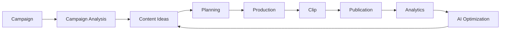
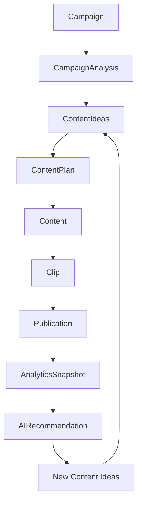

# Architecture

## High-Level Flow

---

# Layers

## UI

React / Next.js components.

Responsible for:

- rendering
- user interactions
- forms
- navigation
- loading states

## Application

Responsible for:

- use cases
- workflows
- orchestration

## Domain

Responsible for:

- campaign rules
- content models
- scoring
- business logic

## Infrastructure

Responsible for:

- database
- AI providers
- storage
- video processing
- external APIs

---

# AI Provider

Use provider abstraction.

AIProvider

Current implementations:

- mock (MockAIProvider)
- hemattoken (HematTokenProvider)

External calls go through the HematToken gateway — the app never connects to Anthropic/OpenAI/Gemini directly. HematTokenProvider speaks the gateway's OpenAI-compatible Chat Completions API through the Vercel AI SDK; mock mode needs no keys so the app is fully usable in dev, tests, CI, and demos.

Flow:

App → AI Service → AI Router → AIProvider → (gateway → model)

The AI Router names a task (campaign_analysis, content_ideas, …), resolves provider + model, and records a request log per call.

The application should depend on AIProvider rather than directly on a vendor SDK.

See docs/AI_INTEGRATION.md for the full implementation record.

---

# Video Processing

Use a VideoProcessingService abstraction.

Potential future implementations:

- FFmpeg
- cloud video processing
- transcription providers
- AI video services

The MVP can use MockVideoProcessingService.

---

# Core Services

CampaignAnalyzer
ContentIdeaGenerator
ScriptGenerator
HookGenerator
ClipDetector
ViralScoreAnalyzer
CaptionGenerator
ContentOptimizer
AnalyticsAnalyzer
ContentPlanner

Each service should have:

- typed input
- typed output
- clear responsibility
- provider independence

---

# Data Flow

---

# Design Principle

Avoid premature abstraction.

Create abstractions where:

- external providers are involved
- multiple implementations are expected
- business logic needs isolation
- testing requires replacement implementations

Do not create abstractions simply to make the codebase look sophisticated.
